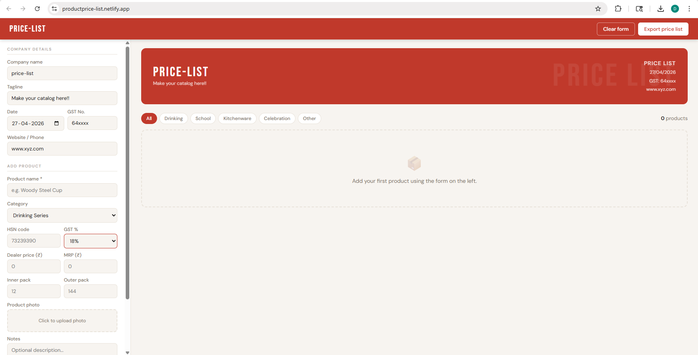
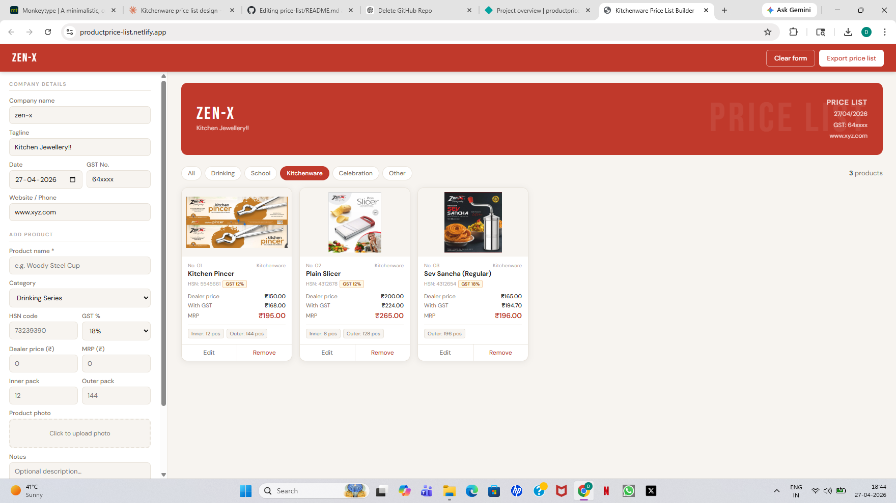
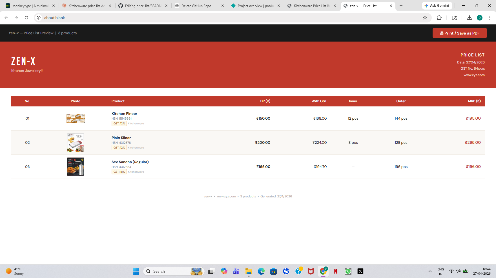

# price-list
A web-based Price List Builder for small businesses to add products, manage pricing, and generate professional catalogs. Includes GST calculation, category filtering, image upload, local storage, and export to a printable PDF format. Built with HTML, CSS and JavaScript with local storage for data persistence.

🚀 Live Demo

🔗 https://productprice-list.netlify.app/

📌 Overview

A web-based Price List Builder designed for small businesses to create and manage product catalogs efficiently.

Users can add products, calculate GST-inclusive pricing, upload images, filter by categories, and export a clean, printable price list (PDF-ready).

🖼️ Screenshots

🔹 Main Interface

  

🔹 Add Product

  

🔹 Price List Output

  

✨ Features

📌 Add, edit, and delete products
💰 Automatic GST calculation
🗂️ Category-based filtering
🖼️ Image upload with preview
💾 Local storage persistence
📄 Export to printable price list (PDF)
🎨 Clean and responsive UI

🛠️ Tech Stack

Frontend: HTML, CSS, JavaScript
Storage: Browser LocalStorage
Deployment: Netlify

